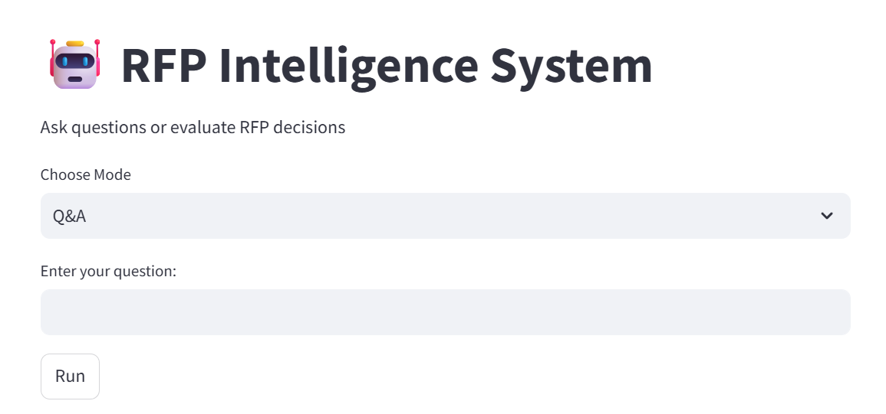
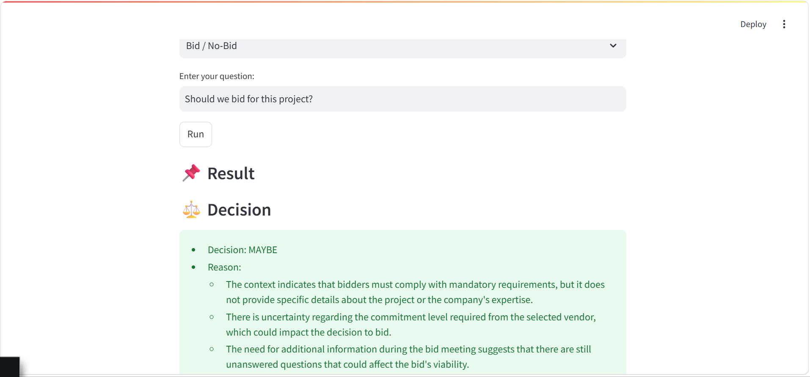

# 🤖 RFP Semantic Retrieval System

An AI-powered **Retrieval-Augmented Generation (RAG)** system that enables semantic search and intelligent question answering over Request for Proposal (RFP) documents.

The system retrieves relevant document sections using **FAISS**, generates grounded responses with **GPT-4o-mini**, and provides a basic **Bid / No-Bid** recommendation.

---

# 📷 Demo

### Question Answering



### Bid / No-Bid Recommendation



---

# ✨ Features

- 🔍 Semantic search using FAISS
- 🤖 Retrieval-Augmented Generation (RAG)
- 💬 Question Answering with GPT-4o-mini
- 📚 Source document citation
- ⚖️ Bid / No-Bid recommendation
- 📄 Support for PDF, DOCX, XLSX, and PPTX documents
- 🚀 FastAPI backend
- 💻 Streamlit frontend

---

# 🏗️ System Workflow

```
RFP Documents
      │
      ▼
Document Loading
      │
      ▼
Text Chunking
      │
      ▼
Embeddings
      │
      ▼
FAISS Vector Database
      │
      ▼
Semantic Retrieval
      │
      ▼
GPT-4o-mini
      │
      ▼
Answer + Sources
```

---

# 🛠️ Tech Stack

- **Language:** Python
- **Framework:** LangChain
- **LLM:** GPT-4o-mini
- **Embeddings:** BAAI/bge-small-en-v1.5
- **Vector Database:** FAISS
- **Backend:** FastAPI
- **Frontend:** Streamlit

---

# 📂 Project Structure

```text
.
├── frontend/
│   └── app.py
├── images/
├── bid_decision.py
├── evaluate.py
├── ingestion_faiss.py
├── llm.py
├── main.py
├── prompt.py
├── rag_chain.py
├── requirements.txt
├── retriever.py
├── test_queries.py
├── README.md
└── .gitignore
```

---

# 🚀 Installation

Clone the repository:

```bash
git clone https://github.com/taif-albalawi/rfp-semantic-retrieval-system.git
```

Create a virtual environment:

```bash
python3 -m venv .venv
source .venv/bin/activate
```

Install dependencies:

```bash
pip install -r requirements.txt
```

Set your OpenAI API key:

```bash
export OPENAI_API_KEY="YOUR_API_KEY"
```

---

# ▶️ Run the Project

### 1. Build the FAISS Index

Place your own RFP documents inside the `data/` folder, then run:

```bash
python3 ingestion_faiss.py
```

### 2. Start the Backend

```bash
uvicorn main:app --reload
```

### 3. Launch the Frontend

```bash
streamlit run frontend/app.py
```

---

# 🔒 Data Privacy

The original RFP documents are **not included** in this repository because they contain confidential information.

To run the project, use your own RFP documents and generate a new FAISS index.

---

# 🔮 Future Improvements

- Advanced reranking
- Confidence scoring
- Authentication
- Cloud deployment
- Multi-user support

---

# 👩‍💻 Author

**Taif Albalawi**

AI Engineering Bootcamp – Saudi Digital Academy (SDA)